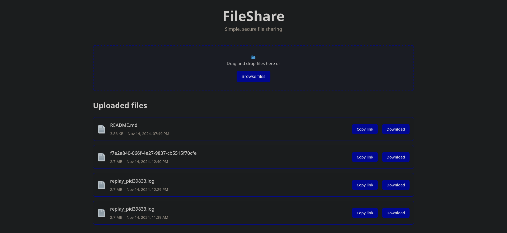

# FileShare - Tutorial


_FileShare - aplikacja do udostępniania plików_

Cześć! Ten tutorial pomoże Ci stworzyć prostą aplikację do udostępniania plików. Jest przeznaczony dla studentów Politechniki Poznańskiej na przedmiot Aplikacje Internetowe.

## Co będziemy robić?

Zbudujemy aplikację webową składającą się z:

- Frontendu
- Backendu

Użyjemy do tego:

- JavaScript po stronie frontendu i backendu
- Frontend: React + Vite (lokalny serwer programistyczny frontendu)
- Backend: Node.js + Express.js (serwer backendu)

## Wymagania

- Zainstalowany Node.js (sprawdź wpisując `node -v` w terminal)
- Jeśli nie masz Node.js, [pobierz go stąd](https://nodejs.org/en/download/)

## Krok 1: Przygotowanie projektu

Najpierw stwórz główny folder projektu:

```bash
mkdir FileShare
cd FileShare
```

## Krok 2: Tworzenie frontendu

Użyjemy Vite do stworzenia projektu React:

```bash
npm create vite@latest fileshare-frontend -- --template react
cd frontend
npm install
npm run dev
```

Po uruchomieniu `npm run dev` zobaczysz przykładową stronę React w przeglądarce.

### Struktura plików frontendu:

- /public
  - vite.svg - ikona strony
- /src
  - assets - miejsce na obrazki i inne zasoby
  - App.css - główny plik ze stylami
  - App.jsx - główny komponent React
  - index.css - style globalne
  - main.jsx - punkt startowy aplikacji
- .gitignore - lista ignorowanych plików
- eslint.config.js - konfiguracja lintera
- index.html - główny plik HTML
- package.json - konfiguracja projektu
- vite.config.js - konfiguracja Vite

Teraz stworzymy dodatkowe foldery i pliki:

```
frontend
├── assets
│ └── react.svg - domyślne logo React
├── components - folder na komponenty React
│ ├── file - komponenty do obsługi plików
│ │ ├── FileItem.jsx - pojedynczy plik na liście
│ │ ├── FileList.jsx - lista wszystkich plików
│ │ └── FileUpload.jsx - formularz do wysyłania plików
│ ├── layout - komponenty układu strony
│ │ └── Header.jsx - nagłówek strony
├── hooks - własne hooki React
│ └── useFiles.js - hook do pobierania listy plików
│ └── useFileUpload.js - hook do wysyłania plików
├── services - komunikacja z API
│ └── api.js - funkcje do komunikacji z backendem
├── styles - pliki CSS
│ ├── base - podstawowe style
│ │ ├── global.css - style globalne
│ │ ├── reset.css - resetowanie domyślnych stylów
│ │ └── typography.css - style dla tekstu
│ │ └── variables.css - zmienne CSS
│ ├── components - style dla komponentów
│ │ ├── Feedback.module.css - style dla komunikatów
│ │ ├── FileList.module.css - style dla listy plików
│ │ ├── FileUpload.module.css - style dla formularza
│ │ └── Header.module.css - style dla nagłówka
│ ├── shared - współdzielone style
│ │ └── buttons.module.css - style dla przycisków
└── utils - funkcje pomocnicze
    └── formatters.js - formatowanie danych
```

## Krok 2.1: Konfiguracja Vite

Po utworzeniu projektu, musimy skonfigurować proxy dla API. Zaktualizuj plik `frontend/vite.config.js`:

```javascript
import { defineConfig } from "vite";
import react from "@vitejs/plugin-react";

export default defineConfig({
  plugins: [react()],
  server: {
    port: 5173,
    proxy: {
      "/api": {
        target: "http://localhost:3001",
        changeOrigin: true,
        rewrite: (path) => path.replace(/^\/api/, ""),
      },
    },
  },
});
```

### Co robi ta konfiguracja?

1. **Port serwera**:

   - Ustawia port deweloperski na 5173

2. **Proxy API**:
   - Przekierowuje wszystkie żądania `/api/*` do backendu
   - Backend działa na `http://localhost:3001`
   - Usuwa przedrostek `/api` z ścieżki żądania
   - Przykład: `/api/files` → `http://localhost:3001/files`

Ta konfiguracja pozwala na bezproblemową komunikację między frontendem a backendem podczas developmentu.

## Krok 3: Pierwsze zmiany

Zmieńmy tytuł strony. W pliku `frontend/index.html`:

```html
<title>FileShare</title>
```

Komponent `FileItem.jsx` odpowiada za wyświetlanie pojedynczego pliku na liście. Zawiera podstawowe informacje o pliku (nazwę, rozmiar, datę) oraz przyciski do pobrania i skopiowania linku.

1. Stwórz plik `frontend/src/components/file/FileItem.jsx`:

```jsx
import PropTypes from "prop-types";
import { formatFileSize, formatDate } from "../../utils/formatters";
import { getDownloadUrl } from "../../services/api";

export const FileItem = ({ file }) => {
  const handleCopyLink = async () => {
    try {
      await navigator.clipboard.writeText(getDownloadUrl(file.fileId));
      alert("Link copied to clipboard!");
    } catch (err) {
      console.error("Failed to copy:", err);
    }
  };

  const handleDownload = () => {
    window.location.href = getDownloadUrl(file.fileId);
  };

  return (
    <div className="file-item">
      <div className="file-icon">📄</div>
      <div className="file-details">
        <div className="file-name">{file.originalName || "Unknown file"}</div>
        <div className="file-info">
          <span className="file-size">{formatFileSize(file.size)}</span>
          <span className="upload-date">{formatDate(file.uploadDate)}</span>
        </div>
      </div>
      <div className="file-actions">
        <button
          className="action-button copy-button"
          onClick={handleCopyLink}
          title="Copy download link"
        >
          Copy link
        </button>
        <button
          className="action-button download-button"
          onClick={handleDownload}
          title="Download file"
        >
          Download
        </button>
      </div>
    </div>
  );
};

FileItem.propTypes = {
  file: PropTypes.shape({
    fileId: PropTypes.string.isRequired,
    originalName: PropTypes.string,
    size: PropTypes.number,
    uploadDate: PropTypes.string,
  }).isRequired,
};
```

### Co się dzieje w tym komponencie?

1. **Importy**:

   - `PropTypes` - do walidacji props
   - `formatFileSize` i `formatDate` - funkcje pomocnicze do formatowania danych
   - `getDownloadUrl` - funkcja do generowania linku do pobrania pliku

2. **Główne funkcjonalności**:

   - `handleCopyLink` - kopiuje link do schowka
   - `handleDownload` - rozpoczyna pobieranie pliku

3. **Struktura komponentu**:

   - Ikona pliku (📄)
   - Szczegóły pliku (nazwa, rozmiar, data)
   - Przyciski akcji (kopiowanie linku i pobieranie)

4. **PropTypes**:
   - Definicja wymaganych właściwości dla komponentu
   - Sprawdzanie typów danych w trybie deweloperskim

## Krok 4: Podstawowy layout

Teraz stworzymy style dla komponentu Header, który będzie odpowiedzialny za wygląd głównego nagłówka strony.

1. Stwórz plik `frontend/src/styles/components/Header.module.css`:

```css
.header {
  text-align: center;
  margin-bottom: 3rem;
}

.subtitle {
  color: #888;
  margin-top: 0.5rem;
  font-size: 1.1rem;
}
```

### Co zawierają te style?

1. **Kontener nagłówka (.header)**:

   - Wycentrowany tekst
   - Duży odstęp od dolnej krawędzi (3rem)
   - Zapewnia odpowiednią separację od głównej zawartości

2. **Podtytuł (.subtitle)**:
   - Szary kolor tekstu dla hierarchii wizualnej
   - Niewielki odstęp od góry
   - Mniejszy rozmiar czcionki niż główny tytuł

Te style zapewniają prosty, ale elegancki wygląd nagłówka strony, z wyraźną hierarchią wizualną między tytułem a podtytułem.

### Przykład użycia:

```jsx
import styles from "../../styles/components/Header.module.css";

export function Header({ title, subtitle }) {
  return (
    <header className={styles.header}>
      <h1>{title}</h1>
      {subtitle && <p className={styles.subtitle}>{subtitle}</p>}
    </header>
  );
}
```

Teraz stworzymy główny komponent aplikacji `App.jsx`, który będzie orkiestrował wszystkie pozostałe komponenty i zarządzał stanem aplikacji.

1. Zaktualizuj plik `frontend/src/App.jsx`:

```jsx
import { Header } from "./components/layout/Header";
import { FileUpload } from "./components/file/FileUpload";
import { FileList } from "./components/file/FileList";
import { useFiles } from "./hooks/useFiles";
import styles from "./styles/components/Feedback.module.css";
import "./styles/base/global.css";

function App() {
  const { files, isLoading, error, refetch } = useFiles();
  const serverUrl = import.meta.env.VITE_SERVER_URL || "http://localhost:3001";

  return (
    <div className="container">
      <Header title="FileShare" subtitle="Simple, secure file sharing" />

      <main>
        <FileUpload onUpload={refetch} serverUrl={serverUrl} />
        {error && <div className={styles.error}>{error}</div>}
        {isLoading ? (
          <div className={styles.loading}>Loading...</div>
        ) : (
          <FileList files={files} />
        )}
      </main>
    </div>
  );
}

export default App;
```

### Co się dzieje w tym komponencie?

1. **Importy**:

   - Komponenty interfejsu (`Header`, `FileUpload`, `FileList`)
   - Hook `useFiles` do zarządzania listą plików
   - Style dla komunikatów zwrotnych
   - Globalne style aplikacji

2. **Konfiguracja**:

   - Pobranie adresu serwera z zmiennych środowiskowych
   - Domyślny fallback na `http://localhost:3001` jeśli zmienna nie jest ustawiona

3. **Zarządzanie stanem**:

   - Użycie hooka `useFiles` do pobrania listy plików
   - Obsługa stanów ładowania i błędów
   - Funkcja `refetch` do odświeżania listy po uploadzie

4. **Struktura komponentu**:
   - Kontener główny z klasą `.container`
   - Nagłówek z tytułem i podtytułem
   - Sekcja główna zawierająca:
     - Formularz uploadu plików
     - Komunikaty o błędach (jeśli występują)
     - Wskaźnik ładowania lub lista plików

### Jak działa przepływ danych?

1. **Inicjalizacja**:

   - Hook `useFiles` pobiera początkową listę plików
   - Stan ładowania jest aktywny podczas pobierania

2. **Upload plików**:

   - Komponent `FileUpload` otrzymuje funkcję `refetch`
   - Po udanym uploadzie lista jest automatycznie odświeżana

3. **Wyświetlanie**:
   - Błędy są pokazywane nad listą plików
   - Podczas ładowania wyświetlany jest wskaźnik
   - Lista plików jest renderowana po załadowaniu danych

Ten komponent stanowi rdzeń aplikacji, łącząc wszystkie funkcjonalności w spójną całość i zarządzając przepływem danych między komponentami.

## Krok 5: Podstawowe style

Teraz skonfigurujemy podstawowe style globalne dla naszej aplikacji. Te style będą definiować główny układ i podstawowe kontenery.

1. Stwórz plik `frontend/src/styles/base/global.css`:

```css
#root {
  max-width: 1280px;
  margin: 0 auto;
  padding: 2rem;
}

.container {
  width: 100%;
}
```

### Co się dzieje w tym pliku?

1. **Główny kontener (#root)**:

   - Maksymalna szerokość 1280px
   - Automatyczne marginesy dla wycentrowania
   - Padding 2rem dla odstępu od krawędzi

2. **Klasa .container**:
   - Pełna szerokość dla responsywności
   - Używana jako wrapper dla głównej zawartości

Teraz stworzymy plik reset CSS, który ujednolici style domyślne przeglądarek.

1. Stwórz plik `frontend/src/styles/base/reset.css`:

```css
*,
*::before,
*::after {
  box-sizing: border-box;
  margin: 0;
  padding: 0;
}

body {
  margin: 0;
  min-width: 320px;
  min-height: 100vh;
}

img,
picture,
video,
canvas,
svg {
  display: block;
  max-width: 100%;
}

input,
button,
textarea,
select {
  font: inherit;
}
```

Teraz stworzymy plik z podstawowymi stylami typograficznymi i elementami interaktywnymi.

1. Stwórz plik `frontend/src/styles/base/typography.css`:

```css
body {
  font-family: var(--font-family);
  line-height: var(--line-height-base);
  font-weight: var(--font-weight-base);
  color: var(--color-text);
  background-color: var(--color-background);

  font-synthesis: none;
  text-rendering: optimizeLegibility;
  -webkit-font-smoothing: antialiased;
  -moz-osx-font-smoothing: grayscale;
}

h1 {
  font-size: 3.2em;
  line-height: 1.1;
}

a {
  font-weight: var(--font-weight-medium);
  color: var(--color-primary);
  text-decoration: inherit;
}

a:hover {
  color: var(--color-primary-hover);
}

button {
  border-radius: 8px;
  border: 1px solid transparent;
  padding: 0.6em 1.2em;
  font-size: 1em;
  font-weight: var(--font-weight-medium);
  font-family: inherit;
  background-color: var(--color-button);
  cursor: pointer;
  transition: border-color 0.25s;
}

button:hover {
  border-color: var(--color-primary);
}

button:focus,
button:focus-visible {
  outline: 4px auto -webkit-focus-ring-color;
}
```

Teraz stworzymy plik ze zmiennymi CSS, które będą definiować główne wartości designu w naszej aplikacji.

1. Stwórz plik `frontend/src/styles/base/variables.css`:

```css
:root {
  /* Colors. */
  --color-primary: #646cff;
  --color-primary-hover: #535bf2;
  --color-background: #242424;
  --color-text: rgba(255, 255, 255, 0.87);
  --color-text-secondary: #888;
  --color-button: #1a1a1a;

  /* Typography. */
  --font-family: Inter, system-ui, Avenir, Helvetica, Arial, sans-serif;
  --line-height-base: 1.5;
  --font-weight-base: 400;
  --font-weight-medium: 500;

  /* Light theme overrides. */
  @media (prefers-color-scheme: light) {
    --color-background: #ffffff;
    --color-text: #213547;
    --color-button: #f9f9f9;
    --color-primary-hover: #747bff;
  }
}
```

## Krok 6: Tworzenie funkcji pomocniczych

Teraz stworzymy funkcje pomocnicze do formatowania rozmiaru plików i dat. Te funkcje będą używane w komponencie FileItem do czytelnego wyświetlania informacji.

1. Stwórz plik `frontend/src/utils/formatters.js`:

```jsx
export const formatFileSize = (bytes) => {
  if (!bytes || bytes === 0) {
    return "0 Bytes";
  }

  const k = 1024;
  const sizes = ["Bytes", "KB", "MB", "GB"];
  const i = Math.floor(Math.log(bytes) / Math.log(k));

  return `${parseFloat((bytes / Math.pow(k, i)).toFixed(2))} ${sizes[i]}`;
};

export const formatDate = (dateString) => {
  if (!dateString) {
    return "Unknown date";
  }

  try {
    return new Date(dateString).toLocaleDateString("en-US", {
      year: "numeric",
      month: "short",
      day: "numeric",
      hour: "2-digit",
      minute: "2-digit",
    });
  } catch (error) {
    console.error("Error formatting date:", error);
    return dateString;
  }
};
```

### Jak działają te funkcje?

1. **formatFileSize**:

   - Przyjmuje rozmiar pliku w bajtach
   - Konwertuje go na czytelny format (np. "2.5 MB")
   - Obsługuje różne jednostki: Bytes, KB, MB, GB
   - Przykład: `formatFileSize(1024)` zwróci "1 KB"

2. **formatDate**:
   - Przyjmuje datę w formacie string
   - Konwertuje ją na czytelny format (np. "Mar 15, 2024, 03:30 PM")
   - Zawiera obsługę błędów dla nieprawidłowych dat
   - Przykład: `formatDate("2024-03-15T15:30:00")` zwróci "Mar 15, 2024, 03:30 PM"

### Przykłady użycia:

```jsx
// Formatowanie rozmiaru pliku
console.log(formatFileSize(1024)); // "1 KB"
console.log(formatFileSize(1048576)); // "1 MB"
console.log(formatFileSize(2.5 * 1024 * 1024)); // "2.5 MB"

// Formatowanie daty
console.log(formatDate("2024-03-15T15:30:00")); // "Mar 15, 2024, 03:30 PM"
console.log(formatDate(null)); // "Unknown date"
```

## Krok 7: Konfiguracja komunikacji z API

Teraz stworzymy serwis do komunikacji z API backendu. Ten serwis będzie odpowiedzialny za wszystkie operacje związane z plikami: pobieranie listy, wysyłanie i generowanie linków do pobrania.

1. Najpierw stwórz plik konfiguracyjny `.env` w folderze `frontend`:

```env
VITE_SERVER_URL=http://localhost:3001
```

2. Stwórz plik `frontend/src/services/api.js`:

```jsx
const API_BASE_URL = import.meta.env.VITE_SERVER_URL || "http://localhost:3001";

export const fetchFiles = async () => {
  const response = await fetch(`${API_BASE_URL}/files`);

  if (!response.ok) {
    throw new Error("Failed to fetch files");
  }

  return response.json();
};

export const uploadFile = async (formData) => {
  const response = await fetch(`${API_BASE_URL}/upload`, {
    method: "POST",
    body: formData,
  });

  if (!response.ok) {
    throw new Error("Failed to upload file");
  }

  return response.json();
};

export const getDownloadUrl = (fileId) => `${API_BASE_URL}/download/${fileId}`;
```

### Co się dzieje w tym pliku?

1. **Konfiguracja**:

   - `API_BASE_URL` - pobiera adres serwera z zmiennych środowiskowych
   - Domyślnie używa `http://localhost:3001` jeśli zmienna nie jest ustawiona

2. **Funkcje API**:

   - `fetchFiles()` - pobiera listę wszystkich plików
   - `uploadFile(formData)` - wysyła nowy plik na serwer
   - `getDownloadUrl(fileId)` - generuje URL do pobrania pliku

3. **Obsługa błędów**:
   - Każda funkcja sprawdza czy odpowiedź jest poprawna (`response.ok`)
   - W przypadku błędu rzuca wyjątek z odpowiednim komunikatem

### Przykład użycia:

```jsx
// Pobieranie listy plików
try {
  const files = await fetchFiles();
  console.log("Lista plików:", files);
} catch (error) {
  console.error("Błąd podczas pobierania:", error);
}

// Wysyłanie pliku
const formData = new FormData();
formData.append("file", fileObject);
try {
  const result = await uploadFile(formData);
  console.log("Plik wysłany:", result);
} catch (error) {
  console.error("Błąd podczas wysyłania:", error);
}

// Generowanie linku do pobrania
const downloadUrl = getDownloadUrl("123abc");
console.log("Link do pobrania:", downloadUrl);
```

## Krok 8: Tworzenie hooków React

Teraz stworzymy własne hooki React, które będą zarządzać stanem plików i operacjami wysyłania. Hooki to specjalne funkcje, które pozwalają na współdzielenie logiki między komponentami.

1. Najpierw stwórz hook `useFiles` w pliku `frontend/src/hooks/useFiles.js`:

```jsx
import { useState, useEffect, useCallback } from "react";
import * as api from "../services/api";

export const useFiles = (refreshInterval = 5000) => {
  const [files, setFiles] = useState([]);
  const [isLoading, setIsLoading] = useState(true);
  const [error, setError] = useState(null);

  const fetchFiles = useCallback(async () => {
    try {
      const data = await api.fetchFiles();
      setFiles(data);
      setError(null);
    } catch (err) {
      setError(err.message);
    } finally {
      setIsLoading(false);
    }
  }, []);

  useEffect(() => {
    fetchFiles();
    const interval = setInterval(fetchFiles, refreshInterval);
    return () => clearInterval(interval);
  }, [fetchFiles, refreshInterval]);

  return { files, isLoading, error, refetch: fetchFiles };
};
```

2. Następnie stwórz hook `useFileUpload` w pliku `frontend/src/hooks/useFileUpload.js`:

```jsx
import { useState } from "react";
import * as api from "../services/api";

export const useFileUpload = (onSuccess) => {
  const [isUploading, setIsUploading] = useState(false);
  const [uploadError, setUploadError] = useState(null);

  const uploadFiles = async (files) => {
    setIsUploading(true);
    setUploadError(null);

    try {
      const formData = new FormData();
      Array.from(files).forEach((file) => {
        formData.append("file", file);
      });

      const data = await api.uploadFile(formData);
      onSuccess?.(data);
    } catch (error) {
      setUploadError(error.message);
      throw error;
    } finally {
      setIsUploading(false);
    }
  };

  return { uploadFiles, isUploading, uploadError };
};
```

### Jak działają te hooki?

1. **useFiles**:

   - Zarządza listą plików
   - Automatycznie odświeża listę co 5 sekund
   - Obsługuje stany ładowania i błędów
   - Udostępnia funkcję `refetch` do ręcznego odświeżania

2. **useFileUpload**:
   - Zarządza procesem wysyłania plików
   - Obsługuje stany ładowania i błędów
   - Przyjmuje callback `onSuccess` wywoływany po udanym wysłaniu

### Przykład użycia w komponencie:

```jsx
function FileManager() {
  const { files, isLoading, error, refetch } = useFiles();
  const { uploadFiles, isUploading } = useFileUpload(refetch);

  const handleUpload = async (event) => {
    try {
      await uploadFiles(event.target.files);
      console.log("Upload successful!");
    } catch (error) {
      console.error("Upload failed:", error);
    }
  };

  if (isLoading) return <div>Loading...</div>;
  if (error) return <div>Error: {error}</div>;

  return (
    <div>
      <input type="file" onChange={handleUpload} disabled={isUploading} />
      <div>
        {files.map((file) => (
          <div key={file.fileId}>{file.originalName}</div>
        ))}
      </div>
    </div>
  );
}
```

## Krok 9: Tworzenie stylów CSS

Teraz stworzymy style CSS dla naszych komponentów. Używamy modułów CSS, które pozwalają na lokalne stylowanie komponentów bez konfliktów nazw.

1. Najpierw stwórz podstawowe style w `frontend/src/styles/base/variables.css`:

```css
:root {
  /* Colors */
  --color-primary: #646cff;
  --color-primary-hover: #535bf2;
  --color-background: #242424;
  --color-text: rgba(255, 255, 255, 0.87);
  --color-text-secondary: #888;
  --color-button: #1a1a1a;

  /* Typography */
  --font-family: Inter, system-ui, Avenir, Helvetica, Arial, sans-serif;
  --line-height-base: 1.5;
  --font-weight-base: 400;
  --font-weight-medium: 500;

  /* Light theme */
  @media (prefers-color-scheme: light) {
    --color-background: #ffffff;
    --color-text: #213547;
    --color-button: #f9f9f9;
    --color-primary-hover: #747bff;
  }
}
```

2. Stwórz style dla listy plików w `frontend/src/styles/components/FileList.module.css`:

```css
.fileList {
  margin-top: 2rem;
}

.fileList h2 {
  margin-bottom: 1.5rem;
  font-size: 1.8rem;
}

.files {
  display: grid;
  gap: 1rem;
}

.fileItem {
  display: flex;
  align-items: center;
  padding: 1rem;
  border: 1px solid var(--color-primary);
  border-radius: 8px;
  background: rgba(255, 255, 255, 0.03);
}

.fileIcon {
  font-size: 2rem;
  margin-right: 1rem;
}

.fileDetails {
  flex: 1;
  min-width: 200px;
}

.fileName {
  font-weight: var(--font-weight-medium);
  font-size: 1.1rem;
  margin-bottom: 0.5rem;
}

.fileInfo {
  display: flex;
  gap: 1rem;
  color: var(--color-text-secondary);
  font-size: 0.9rem;
  flex-wrap: wrap;
}
```

3. Stwórz style dla formularza upload w `frontend/src/styles/components/FileUpload.module.css`:

```css
.uploadContainer {
  margin-bottom: 2rem;
}

.dropZone {
  border: 2px dashed var(--color-primary);
  border-radius: 8px;
  padding: 2rem;
  text-align: center;
  background: rgba(100, 108, 255, 0.05);
}

.fileInput {
  display: none;
}

.fileInputLabel {
  background: var(--color-primary);
  color: white;
  padding: 0.6em 1.2em;
  border-radius: 8px;
  cursor: pointer;
  display: inline-block;
  margin-top: 1rem;
}

.fileInputLabel:hover {
  background: var(--color-primary-hover);
}
```

### Co się dzieje w tych plikach?

1. **variables.css**:

   - Definiuje globalne zmienne CSS używane w całej aplikacji
   - Zawiera kolory, typografię i inne współdzielone wartości
   - Obsługuje tryb jasny i ciemny

2. **FileList.module.css**:

   - Tworzy układ siatki dla listy plików
   - Styluje pojedyncze elementy plików
   - Zapewnia responsywność na różnych urządzeniach

3. **FileUpload.module.css**:
   - Styluje strefę przeciągania i upuszczania plików
   - Ukrywa natywny input typu file
   - Tworzy atrakcyjny wizualnie przycisk wyboru plików

### Jak używać tych stylów?

W komponentach React importujemy style jako moduły:

```jsx
import styles from "../../styles/components/FileList.module.css";

export function FileList() {
  return (
    <div className={styles.fileList}>
      <div className={styles.fileItem}>{/* zawartość */}</div>
    </div>
  );
}
```

## Krok 10: Tworzenie komponentu FileList

Teraz stworzymy komponent `FileList`, który będzie wyświetlał listę wszystkich plików. Komponent ten będzie wyświetlał pliki posortowane według daty dodania oraz umożliwiał ich pobieranie i kopiowanie linków.

1. Stwórz plik `frontend/src/components/file/FileList.jsx`:

```jsx
import PropTypes from "prop-types";
import { formatFileSize, formatDate } from "../../utils/formatters";
import { getDownloadUrl } from "../../services/api";
import styles from "../../styles/components/FileList.module.css";
import buttonStyles from "../../styles/shared/buttons.module.css";

export function FileList({ files }) {
  if (!files || files.length === 0) {
    return null;
  }

  const sortedFiles = [...files].sort((a, b) => {
    const dateA = a.uploadDate ? new Date(a.uploadDate) : new Date(0);
    const dateB = b.uploadDate ? new Date(b.uploadDate) : new Date(0);
    return dateB - dateA;
  });

  const handleCopyLink = (fileId) => {
    if (!fileId) return;

    navigator.clipboard
      .writeText(getDownloadUrl(fileId))
      .then(() => alert("Link copied to clipboard!"))
      .catch((err) => console.error("Failed to copy:", err));
  };

  const handleDownload = (fileId) => {
    if (!fileId) return;
    window.location.href = getDownloadUrl(fileId);
  };

  return (
    <div className={styles.fileList}>
      <h2>Uploaded files</h2>
      <div className={styles.files}>
        {sortedFiles
          .filter((file) => file && file.fileId)
          .map((file) => (
            <div key={file.fileId} className={styles.fileItem}>
              <div className={styles.fileIcon}>📄</div>
              <div className={styles.fileDetails}>
                <div className={styles.fileName}>
                  {file.originalName || "Unknown file"}
                </div>
                <div className={styles.fileInfo}>
                  <span className={styles.fileSize}>
                    {formatFileSize(file.size)}
                  </span>
                  <span className={styles.uploadDate}>
                    {formatDate(file.uploadDate)}
                  </span>
                </div>
              </div>
              <div className={styles.fileActions}>
                <button
                  className={buttonStyles.shareButton}
                  onClick={() => handleCopyLink(file.fileId)}
                  title="Copy download link"
                >
                  Copy link
                </button>
                <button
                  className={buttonStyles.shareButton}
                  onClick={() => handleDownload(file.fileId)}
                  title="Download file"
                >
                  Download
                </button>
              </div>
            </div>
          ))}
      </div>
    </div>
  );
}

FileList.propTypes = {
  files: PropTypes.arrayOf(
    PropTypes.shape({
      fileId: PropTypes.string,
      originalName: PropTypes.string,
      size: PropTypes.number,
      uploadDate: PropTypes.string,
    })
  ).isRequired,
};
```

### Co się dzieje w tym komponencie?

1. **Importy**:

   - Funkcje pomocnicze do formatowania (`formatFileSize`, `formatDate`)
   - Funkcja `getDownloadUrl` do generowania linków
   - Style modułowe dla komponentu i przycisków

2. **Główne funkcjonalności**:

   - Sortowanie plików według daty (od najnowszych)
   - Kopiowanie linków do schowka
   - Pobieranie plików
   - Filtrowanie nieprawidłowych wpisów

3. **Struktura komponentu**:

   - Nagłówek sekcji
   - Lista plików z ikonami
   - Szczegóły pliku (nazwa, rozmiar, data)
   - Przyciski akcji (kopiowanie, pobieranie)

4. **Walidacja props**:
   - Wymagana tablica obiektów `files`
   - Każdy plik musi mieć określoną strukturę
   - Obsługa brakujących danych

### Style dla komponentu

W pliku `frontend/src/styles/components/FileList.module.css`:

```css
.fileList {
  margin-top: 2rem;
}

.fileList h2 {
  margin-bottom: 1.5rem;
  font-size: 1.8rem;
}

.files {
  display: grid;
  gap: 1rem;
}

.fileItem {
  display: flex;
  align-items: center;
  padding: 1rem;
  border: 1px solid #646cff;
  border-radius: 8px;
  background: rgba(255, 255, 255, 0.03);
}

.fileIcon {
  font-size: 2rem;
  margin-right: 1rem;
}

.fileDetails {
  flex: 1;
  min-width: 200px;
}

.fileName {
  font-weight: 500;
  font-size: 1.1rem;
  margin-bottom: 0.5rem;
}

.fileInfo {
  display: flex;
  gap: 1rem;
  color: #888;
  font-size: 0.9rem;
  flex-wrap: wrap;
}

.shareLink {
  margin-top: 0.5rem;
  color: #646cff;
  word-break: break-all;
}

@media (max-width: 640px) {
  .fileItem {
    flex-direction: column;
    align-items: flex-start;
    gap: 1rem;
  }
}
```

## Krok 11: Tworzenie komponentu FileUpload

Teraz stworzymy komponent `FileUpload`, który będzie odpowiedzialny za wysyłanie plików na serwer.

1. Stwórz plik `frontend/src/components/file/FileUpload.jsx`:

```jsx
import { useState, useCallback } from "react";
import PropTypes from "prop-types";
import styles from "../../styles/components/FileUpload.module.css";

export function FileUpload({ onUpload, serverUrl }) {
  const [isUploading, setIsUploading] = useState(false);

  const uploadFile = useCallback(
    async (files) => {
      setIsUploading(true);
      try {
        const formData = new FormData();
        for (const file of files) {
          formData.append("file", file);
        }

        const response = await fetch(`${serverUrl}/upload`, {
          method: "POST",
          body: formData,
        });

        const data = await response.json();
        onUpload([data]);
      } catch (error) {
        console.error("Upload failed:", error);
      } finally {
        setIsUploading(false);
      }
    },
    [serverUrl, onUpload]
  );

  const handleFileSelect = useCallback(
    (e) => {
      const files = [...e.target.files];
      if (files && files.length > 0) {
        uploadFile(files);
      }
    },
    [uploadFile]
  );

  return (
    <div className={styles.uploadContainer}>
      <div className={styles.dropZone}>
        <div className={styles.uploadIcon}>📁</div>
        <p>{isUploading ? "Uploading..." : "Select files to upload"}</p>
        <label className={styles.fileInputLabel}>
          <input
            type="file"
            multiple
            onChange={handleFileSelect}
            className={styles.fileInput}
            disabled={isUploading}
          />
          Browse files
        </label>
      </div>
    </div>
  );
}

FileUpload.propTypes = {
  onUpload: PropTypes.func.isRequired,
  serverUrl: PropTypes.string.isRequired,
};
```

2. Zaktualizuj style w `frontend/src/styles/components/FileUpload.module.css`:

```css
.uploadContainer {
  margin-bottom: 2rem;
}

.dropZone {
  border: 2px dashed #646cff;
  border-radius: 8px;
  padding: 2rem;
  text-align: center;
  background: rgba(100, 108, 255, 0.05);
}

.fileInput {
  display: none;
}

.fileInputLabel {
  background: #646cff;
  color: white;
  padding: 0.6em 1.2em;
  border-radius: 8px;
  cursor: pointer;
  display: inline-block;
  margin-top: 1rem;
}

.fileInputLabel:hover {
  background: #535bf2;
}
```

W następnym kroku dodamy obsługę postępu wysyłania i komunikaty o błędach.

## Krok 12: Tworzenie komponentu Header

Teraz stworzymy prosty komponent `Header`, który będzie wyświetlał tytuł i podtytuł aplikacji.

1. Stwórz plik `frontend/src/components/layout/Header.jsx`:

```jsx
import PropTypes from "prop-types";
import styles from "../../styles/components/Header.module.css";

export const Header = ({ title, subtitle }) => (
  <header className={styles.header}>
    <h1>{title}</h1>
    {subtitle && <p className={styles.subtitle}>{subtitle}</p>}
  </header>
);

Header.propTypes = {
  title: PropTypes.string.isRequired,
  subtitle: PropTypes.string,
};
```

2. Stwórz style dla komponentu w `frontend/src/styles/components/Header.module.css`:

```css
.header {
  text-align: center;
  margin-bottom: 3rem;
}

.subtitle {
  color: #888;
  margin-top: 0.5rem;
  font-size: 1.1rem;
}
```

## Krok 13: Feedback i komunikaty

Teraz skonfigurujemy główny punkt wejścia aplikacji w pliku `main.jsx`. Ten plik jest odpowiedzialny za zainicjowanie aplikacji React i załadowanie wszystkich podstawowych stylów.

1. Zaktualizuj plik `frontend/src/main.jsx`:

```javascript:frontend/src/main.jsx
import { StrictMode } from "react";
import { createRoot } from "react-dom/client";
import "./styles/base/reset.css";
import "./styles/base/variables.css";
import "./styles/base/typography.css";
import "./styles/base/global.css";
import App from "./App.jsx";

createRoot(document.getElementById("root")).render(
  <StrictMode>
    <App />
  </StrictMode>
);
```

### Co się dzieje w tym pliku?

1. **Importy React**:

   - `StrictMode` - komponent do wykrywania potencjalnych problemów
   - `createRoot` - API do renderowania aplikacji React

2. **Importy stylów**:

   - Kolejność importów jest ważna:
     1. `reset.css` - resetuje domyślne style przeglądarki
     2. `variables.css` - definiuje zmienne CSS
     3. `typography.css` - style dla tekstu
     4. `global.css` - globalne style aplikacji

3. **Renderowanie**:
   - Użycie `createRoot` zamiast przestarzałego `ReactDOM.render`
   - Opakowanie aplikacji w `StrictMode` dla lepszego debugowania
   - Renderowanie głównego komponentu `App`

### Dlaczego taka kolejność stylów?

1. Najpierw resetujemy style przeglądarki
2. Następnie definiujemy zmienne CSS
3. Potem ustawiamy podstawowe style typograficzne
4. Na końcu dodajemy globalne style aplikacji

Ta kolejność zapewnia prawidłowe nadpisywanie stylów i unikanie konfliktów.

Teraz stworzymy style dla stanów ładowania i komunikatów o błędach, które będą używane w całej aplikacji.

1. Stwórz plik `frontend/src/styles/components/Feedback.module.css`:

```css
.loading {
  text-align: center;
  color: #888;
  padding: 2rem;
}

.error {
  color: #ff4444;
  background: rgba(255, 68, 68, 0.1);
  padding: 1rem;
  border-radius: 8px;
  margin: 1rem 0;
}
```

### Jak używać tych stylów?

Style te można wykorzystać w dowolnym komponencie do wyświetlania stanów ładowania i błędów. Na przykład:

```jsx
import styles from "../../styles/components/Feedback.module.css";

export function SomeComponent() {
  const [isLoading, setIsLoading] = useState(true);
  const [error, setError] = useState(null);

  if (isLoading) {
    return <div className={styles.loading}>Loading...</div>;
  }

  if (error) {
    return <div className={styles.error}>Error: {error}</div>;
  }

  return <div>Component content</div>;
}
```

### Co zawierają te style?

1. **Stan ładowania (.loading)**:

   - Wycentrowany tekst
   - Szary kolor dla subtelnego wyglądu
   - Odpowiednie odstępy

2. **Komunikat o błędzie (.error)**:
   - Czerwony tekst dla zwrócenia uwagi
   - Delikatne czerwone tło
   - Zaokrąglone rogi
   - Odpowiednie marginesy i padding

Te style są już używane w komponencie FileList do wyświetlania stanów ładowania i błędów podczas pobierania listy plików.

## Krok 14: Style dla przycisków

Teraz stworzymy współdzielone style dla przycisków, które będą używane w całej aplikacji.

1. Stwórz plik `frontend/src/styles/shared/buttons.module.css`:

```css
.button {
  background: #646cff;
  color: white;
  border: none;
  padding: 0.6em 1.2em;
  border-radius: 8px;
  cursor: pointer;
  font-size: 0.9rem;
  transition: background-color 0.2s;
}

.button:hover {
  background: #535bf2;
}

.copyButton {
  composes: button;
  background: #4b4b4b;
}

.copyButton:hover {
  background: #5a5a5a;
}

.shareButton {
  composes: button;
  margin-left: 1rem;
}

.fileActions {
  display: flex;
  gap: 0.5rem;
  margin-left: 1rem;
}

@media (max-width: 640px) {
  .shareButton {
    margin-left: 0;
    width: 100%;
  }

  .fileActions {
    margin-left: 0;
    width: 100%;
    flex-direction: row;
    gap: 0.5rem;
  }

  .button {
    flex: 1;
    text-align: center;
  }
}
```

### Co zawierają te style?

1. **Podstawowy przycisk (.button)**:

   - Kolor tła w odcieniu fioletowym (#646cff)
   - Biały tekst dla kontrastu
   - Zaokrąglone rogi
   - Płynna animacja przy hover
   - Kursor pointer

2. **Przycisk kopiowania (.copyButton)**:

   - Dziedziczy style z .button (przez composes)
   - Ciemniejszy kolor tła
   - Własny efekt hover

3. **Przycisk udostępniania (.shareButton)**:

   - Dziedziczy style z .button
   - Dodatkowy margines z lewej strony
   - Na mobilnych urządzeniach zajmuje pełną szerokość

4. **Kontener akcji (.fileActions)**:

   - Flexbox dla układu przycisków
   - Odstępy między przyciskami
   - Responsywne zachowanie na małych ekranach

5. **Responsywność**:
   - Dostosowanie układu na ekranach mobilnych (<640px)
   - Przyciski zajmują pełną szerokość
   - Zachowanie odstępów między przyciskami
   - Wyrównanie tekstu do środka

Te style zapewniają spójny wygląd przycisków w całej aplikacji, z uwzględnieniem różnych wariantów i responsywności.

## Krok 15: Inicjalizacja backendu

Otwórz nowy terminal i stwórz folder na backend:

```bash
mkdir backend
cd backend
npm init -y fileshare-backend
```

## Krok 16: Struktura projektu

```
backend/
├── src/                  # Kod źródłowy
│   ├── app.js            # Główny plik aplikacji
│   ├── config/           # Konfiguracja
│   │   └── config.js     # Ustawienia aplikacji
│   ├── middleware/       # Middleware
│   │   └── upload.js     # Middleware do obsługi plików
│   ├── routes/           # Routing
│   │   └── file.js       # Endpointy związane z plikami
│   └── services/         # Serwisy
│       ├── file.js       # Operacje na plikach
│       └── metadata.js   # Zarządzanie metadanymi
├── .env                  # Zmienne środowiskowe
├── .gitignore            # Ignorowane pliki
└── package.json          # Konfiguracja projektu
```

## Krok 17: Konfiguracja package.json

```json
{
  "scripts": {
    "start": "node src/app.js",
    "dev": "nodemon src/app.js"
  },
  "nodemonConfig": {
    "ignore": ["uploads/*", "*.test.js"]
  }
}
```

## Krok 18: Konfiguracja .gitignore

Stwórz plik `.gitignore` w folderze backend:

```gitignore
# Dependencies
node_modules

# Uploads
uploads/*

# Editor and OS files
.vscode/*
!.vscode/extensions.json
.idea
.DS_Store
*.suo
*.ntvs*
*.njsproj
*.sln
*.sw?

# Logs
logs
*.log
npm-debug.log*
yarn-debug.log*
yarn-error.log*
pnpm-debug.log*
lerna-debug.log*
```

Ten plik `.gitignore` określa:

- Ignorowanie folderu `node_modules` i `package-lock.json`
- Ignorowanie plików środowiskowych (`.env`)
- Ignorowanie logów
- Ignorowanie zawartości folderu `uploads` (z wyjątkiem pliku `.gitkeep`)
- Ignorowanie plików IDE i systemowych

## Krok 19: Zmienne środowiskowe

Stwórz plik `.env`:

```env
PORT=3001
UPLOAD_DIR=./uploads
```

## Krok 20: Uruchomienie serwera

```bash
npm run dev
```

Serwer będzie dostępny pod adresem http://localhost:3001.

## Krok 21: Główny plik aplikacji

Stwórz główny plik aplikacji `src/app.js`:

```javascript
import express from "express";
import cors from "cors";
import fs from "fs/promises";
import { fileService } from "./services/file.js";
import { metadataService } from "./services/metadata.js";
import { config } from "./config/config.js";
import fileRoutes from "./routes/file.js";

const initializeApp = async () => {
  // Upewnij się, że folder uploads istnieje
  try {
    await fs.access(config.uploadsDir);
  } catch {
    await fs.mkdir(config.uploadsDir, { recursive: true });
  }

  const app = express();

  // Middleware
  app.use(cors(config.corsOptions));
  app.use(express.json());

  // Inicjalizacja serwisów
  await metadataService.loadMetadata();
  await fileService.scanExistingFiles(metadataService.getMetadata());

  // Routing
  app.use("/", fileRoutes);

  // Uruchomienie serwera
  app.listen(config.port, () => {
    console.log(`Server running at http://localhost:${config.port}`);
  });
};

initializeApp().catch(console.error);
```

## Krok 22: Konfiguracja aplikacji

Stwórz plik konfiguracyjny `src/config/config.js`:

```javascript
import dotenv from "dotenv";
import path from "path";
import { fileURLToPath } from "url";

dotenv.config();

const __dirname = path.dirname(fileURLToPath(import.meta.url));

export const config = {
  port: process.env.PORT || 3001,
  uploadsDir: path.join(
    __dirname,
    "../../",
    process.env.UPLOAD_DIR || "uploads"
  ),
  corsOptions: {
    origin: "http://localhost:5173", // Adres frontendu
    optionsSuccessStatus: 200,
  },
};

// Ścieżka do pliku z metadanymi
export const metadataPath = path.join(config.uploadsDir, "metadata.json");
```

## Krok 23: Serwisy aplikacji

Stwórz podstawowe serwisy:

`src/services/metadata.js`:

```javascript
import fs from "fs/promises";
import { metadataPath } from "../config/config.js";

class MetadataService {
  #metadata = new Map();

  async loadMetadata() {
    try {
      const data = await fs.readFile(metadataPath, "utf8");
      const parsedData = JSON.parse(data);
      this.#metadata = new Map(Object.entries(parsedData));
    } catch (error) {
      if (error.code !== "ENOENT") {
        console.error("Error loading metadata:", error);
      }
    }
  }

  async saveMetadata() {
    try {
      await fs.writeFile(
        metadataPath,
        JSON.stringify(Object.fromEntries(this.#metadata))
      );
    } catch (error) {
      console.error("Error saving metadata:", error);
      throw error;
    }
  }

  setMetadata(fileId, metadata) {
    this.#metadata.set(fileId, metadata);
  }

  getMetadata() {
    return this.#metadata;
  }
}

export const metadataService = new MetadataService();
```

`src/services/file.js`:

```javascript
import fs from "fs/promises";
import path from "path";
import { config } from "../config/config.js";

class FileService {
  #fileRegistry = new Map();

  async scanExistingFiles(metadata) {
    try {
      const files = await fs.readdir(config.uploadsDir);

      for (const filename of files) {
        if (filename === ".gitkeep" || filename === "metadata.json") continue;

        const filePath = path.join(config.uploadsDir, filename);
        const stats = await fs.stat(filePath);
        const fileId = filename;
        const fileMetadata = metadata.get(fileId);

        if (!this.#fileRegistry.has(fileId)) {
          this.#fileRegistry.set(fileId, {
            fileId,
            filename: fileId,
            originalName: fileMetadata?.originalName || fileId,
            size: stats.size,
            uploadDate: fileMetadata?.uploadDate || stats.mtime.toISOString(),
          });
        }
      }
      console.log(`Scanned ${files.length} existing files`);
    } catch (error) {
      console.error("Error scanning existing files:", error);
      throw error;
    }
  }

  registerFile(fileInfo) {
    this.#fileRegistry.set(fileInfo.fileId, fileInfo);
  }

  getFileInfo(fileId) {
    return this.#fileRegistry.get(fileId);
  }

  getAllFiles() {
    return Array.from(this.#fileRegistry.values());
  }
}

export const fileService = new FileService();
```

## Krok 24: Routing aplikacji

Stwórz podstawowy routing w `src/routes/file.js`:

```javascript
import { Router } from "express";
import path from "path";
import { fileService } from "../services/file.js";
import { metadataService } from "../services/metadata.js";
import { upload } from "../middleware/upload.js";
import { config } from "../config/config.js";

const router = Router();

router.post("/upload", upload.single("file"), async (req, res) => {
  try {
    if (!req.file) {
      return res.status(400).json({ error: "No file uploaded" });
    }

    const file = req.file;
    const fileId = file.filename;
    const uploadDate = new Date().toISOString();

    const fileInfo = {
      fileId,
      filename: fileId,
      originalName: file.originalname,
      size: file.size,
      uploadDate,
    };

    fileService.registerFile(fileInfo);
    metadataService.setMetadata(fileId, {
      originalName: file.originalname,
      uploadDate,
    });
    await metadataService.saveMetadata();

    res.json(fileInfo);
  } catch (error) {
    console.error("Upload error:", error);
    res.status(500).json({ error: "Upload failed", details: error.message });
  }
});

router.get("/files", (req, res) => {
  res.json(fileService.getAllFiles());
});

router.get("/download/:fileId", async (req, res) => {
  const { fileId } = req.params;
  const fileInfo = fileService.getFileInfo(fileId);

  if (!fileInfo) {
    return res.status(404).json({ error: "File not found in registry" });
  }

  try {
    const filePath = path.join(config.uploadsDir, fileInfo.filename);
    return res.download(filePath, fileInfo.originalName);
  } catch (error) {
    console.error("Error downloading file:", error);
    res.status(500).json({
      error: "Failed to download file",
      details: error.message,
    });
  }
});

export default router;
```

## Krok 25: Dokumentacja API

1. **Upload pliku** - `POST /upload`

   - Przyjmuje plik przez multipart/form-data
   - Używa middleware `upload.single("file")`
   - Zapisuje plik i metadane
   - Zwraca informacje o zapisanym pliku

2. **Lista plików** - `GET /files`

   - Zwraca listę wszystkich dostępnych plików
   - Zawiera podstawowe informacje o każdym pliku

3. **Pobieranie pliku** - `GET /download/:fileId`
   - Pobiera plik o podanym ID
   - Używa oryginalnej nazwy pliku
   - Obsługuje błędy (404, 500)

### Przykłady użycia

1. **Upload pliku**:

```bash
curl -X POST -F "file=@dokument.pdf" http://localhost:3001/upload
```

2. **Lista plików**:

```bash
curl http://localhost:3001/files
```

3. **Pobieranie pliku**:

```bash
curl http://localhost:3001/download/123 --output dokument.pdf
```

### Obsługa błędów

- Brak pliku w żądaniu upload
- Plik nie znaleziony przy pobieraniu
- Błędy serwera przy operacjach na plikach
